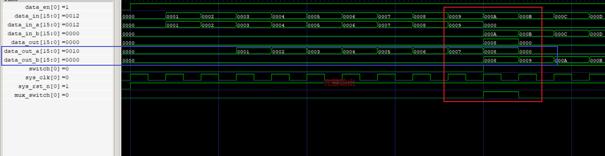

# 简单的verilog 乒乓buffer操作

## 1.文件目录：
```
│  build.bat
│  data_gen.v
│  pingpang.v
│  pingpang_tb.sv
│  readme.md
│
└─assert
        2.png
        3.png
        4.png
        5.png
```
### 文件说明：

build.bat --->win下iverilog编译测试

data_gen  --->测试用数据生成器

pingpang  --->乒乓操作rtl

pingpang_tb -->测试文件


## 2.功能说明：
```
实现输入输出缓存模块，包括a to b 与b to a两条通道（每个通道两个buffer，共四个）

当switch为高时，切换buffer
```

|   输入   | 输出  |
|  ----  | ----  |
| data_in_a[15:0] | data_out_a[15:0] |
| clk  
|rst_n 
| data_in_b[15:0] | data_out_b[15:0] |
|switch
|

## 3.设计验证说明：
- 1.switch 切换的时候
  
	

	对于switch信号要进行打拍处理
	这样才能完整输出

	


- 2.输出同步和异步的问题
  
  	
  	
  	


**ToDo**
- [ ] 对乒乓中的buffer增加数据处理模块